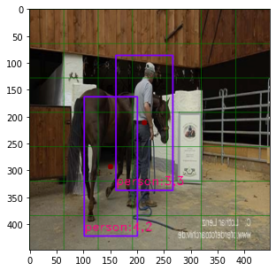

# YOLOv1 - pytorch

* YOLO 시리즈 학습 목적
* 막히는 부분은 darknet을 참고하여 구현 - 링크: [pjreddie/darknet](https://github.com/pjreddie/darknet/tree/8c5364f58569eaeb5582a4915b36b24fc5570c76)
* 논문 + 다크넷 YOLOv1 설정을 최대한 비슷하게 구현하는 것을 목적으로 합니다.

## 데이터 - VOC 2007/2012

* VOC 데이터를 다운로드하여 `VOCdevkit` 하위에 `VOC{year}` 형식으로 정리.
* `scripts/parse_voc_annotations.py`를 통해 ltrb 형식의 어노테이션 xml 파일을 xywh 형식의 text 파일로 변환. 
  * 변환된 text 파일은 xml 파일과 같은 디렉토리에 저장됨.
```commandline
{voc_root}
└── VOCdevkit
    ├── VOC2007
    │   ├── Annotations
    │   ├── ImageSets
    │   ├── JPEGImages
    │   ├── SegmentationClass
    │   └── SegmentationObject
    ├── VOC2007test
    │   ├── Annotations
    │   ├── ImageSets
    │   ├── JPEGImages
    │   ├── SegmentationClass
    │   └── SegmentationObject
    └── VOC2012
        ├── Annotations
        ├── ImageSets
        ├── JPEGImages
        ├── SegmentationClass
        └── SegmentationObject
```

## 학습

```commandline
python3 train.py --voc_root {voc_root: VOC 데이터 디렉토리}
```

epoch마다 `temp_yolo.pth`로 모델 저장, 40000 스텝 학습 후 `yolo_last.pth` 저장.

* 기타 arguments
  * `seed (int: 0)`: seed
  * `backbone (str: resnet18)`: timm 백본 이름 (forward_features 메소드 포함하는 경우로 한정)
  * `inp_size (int: 448)`: input 이미지 사이즈
  * `B (int: 2)`: 그리드의 predictor 수
  * `C (int: 20)`: 클래스 수
  * `S (int: 7)`: 그리드의 수(`inp_size/백본의다운샘플배수`와 같아야함)
  * `batch_size (int: 64)`
  * `subdivision (int: 2)`: 하나의 미니배치를 `subdivision`으로 나누어 처리(GPU 메모리 부족시에)
  * `num_worker (int: 8)`: dataloader worker 수
  * `lambda_coord (float: 5.)`: localization(box) loss 가중치
  * `lambda_noobj (float: .5)`: no-object confidence score loss 가중치
  * `lr (float: 1e-2)`: 초기 가중치. 1/10 값에서부터 웜업
  * `warmup_epochs (int: 2)`: 지정한 epochs동안 lr warmup 수행 (linear / 2 epochs: 약 1100 steps)
  * `momentum (float: .9)`
  * `weight_decay (float: 5e-4)`

## 예측

```commandline
python3 predict.py --img {이미지경로} --saved_pth {YOLO pth 경로} --save_path {예측 결과 저장 경로}
```
* 기타 arguments
  * gpu (action: store_true): gpu 사용 여부
  * score_threshold (float: .2): prediction score threshold
  * iou_threshold (float: .4): NMS IoU threshold
  * hflip (action: store_true): 좌우 플립 수행

`{save_path}/{이미지이름}_predict.jpg`로 예측 결과 저장

resnet18 backbone 모델 결과:


## 모델

* timm 모델을 백본으로 이용 - 기본: resnet18
* 백본 외에는 논문 설정 이용
  * 4개의 추가 conv + 2개의 dense + dropout + linear activation

## 구현 중 문제 발생

### 해결: 논문 그대로의 lr 설정하면 발산
* 해결: 가중치 초기화 문제로 생각되어 다크넷의 가중치 초기화 방식을 그대로 이용하여 해결
* TODO: 내용 정리

### 해결: 두 오브젝트의 상대위치가 좌하단-우상단인 경우 디텍션 성능 하락
* 해결: loss 코드 오류 - 오브젝트가 존재하는 위치의 prediction 값을 가져오는 과정에서 오브젝트의 순서와 prediction의 순서가 어긋날 수 있는 코드를 작성함. True/False mask 대신 인덱스를 통해 가져오도록 변경함.
  * ```python
          # loss.py
          ...
          # obj grid indicator
          obj_grid_index = target[:, :3].long()
          obj_grid_mask = torch.zeros(batch, S, S, dtype=torch.bool, device=device)
          obj_grid_mask.index_put_(torch.split(obj_grid_index, 1, dim=-1), torch.tensor(True, device=device))
          ######################################################################
          # mask를 생성하면서 오브젝트의 순서가 사라짐
          ######################################################################
          assert obj_grid_mask.sum().item() == N, 'obj_grid_mask'

          # object grid - pred에서 오브젝트가 위치한 그리드의 예측값
          obj_grid_pred = pred[obj_grid_mask]

          ######################################################################
          # Ture/False mask는 오브젝트 순서를 반영하지 못함 -> prediction과 target의 페어가 어긋남
          ######################################################################
          ...
    ```
* 문제
  * 오브젝트의 우상단에 다른 오브젝트가 위치하면 박스 크기, 컨피던스 스코어, 클래스 예측에 문제가 발생.
  * 많은 샘플에서 문제 발생.
  * 아래 예시는 VOC2007 데이터로 좌우 플립 어그멘테이션을 적용하므로 모두 학습에 사용된 샘플임.
    * 예시 - 모두 학습에 이용되었으나 오브젝트간 상대적인 위치에 따라 학습이 제대로 되지 않은듯한 결과 출력.
      * 박스 크기, 클래스 예측 에러
        * 
        * 
      * 박스 크기, 컨피던스 스코어, 클래스 예측 에러
        * 
        * 
      * 박스 크기 예측 에러 (사람 박스의 width)
        * 
        * 

## TODO